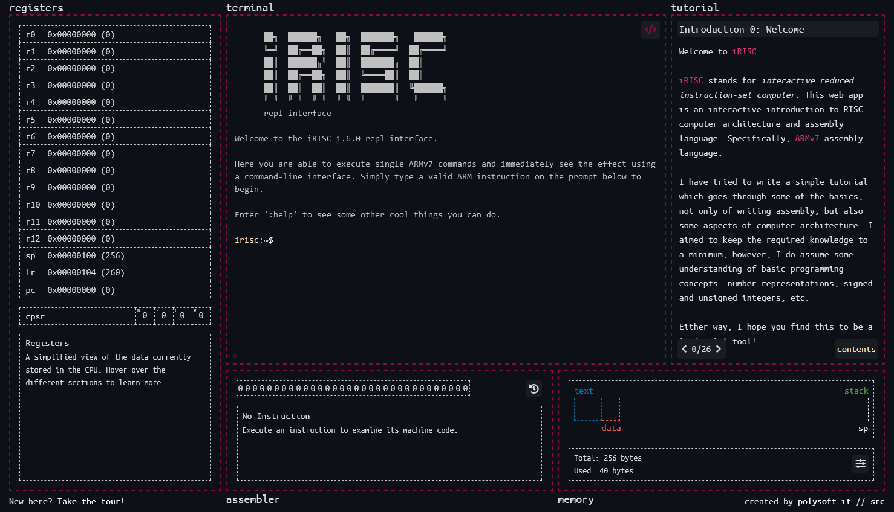

<div id="top"></div>
<!--
*** Thanks for checking out the Best-README-Template. If you have a suggestion
*** that would make this better, please fork the repo and create a pull request
*** or simply open an issue with the tag "enhancement".
*** Don't forget to give the project a star!
*** Thanks again! Now go create something AMAZING! :D
-->


<!-- PROJECT SHIELDS -->
<!--
*** I'm using markdown "reference style" links for readability.
*** Reference links are enclosed in brackets [ ] instead of parentheses ( ).
*** See the bottom of this document for the declaration of the reference variables
*** for contributors-url, forks-url, etc. This is an optional, concise syntax you may use.
*** https://www.markdownguide.org/basic-syntax/#reference-style-links
-->
[![Contributors][contributors-shield]][contributors-url]
[![Forks][forks-shield]][forks-url]
[![Stargazers][stars-shield]][stars-url]
[![Issues][issues-shield]][issues-url]
[![MIT License][license-shield]][license-url]
[![LinkedIn][linkedin-shield]][linkedin-url]


<!-- PROJECT LOGO -->
<br />
<div align="center">
  <a href="https://github.com/rtybanana/irisc-web">
    
  </a>

<h3 align="center">iRISC</h3>

  <p align="center">
    An interactive web-based ARMv7 assembly language interpreter and computer architecture simulator.
    <br />
    <a href="https://github.com/rtybanana/irisc-web">Start Now!</a>
    ·
    <a href="https://github.com/rtybanana/irisc-web/issues">Report Bug</a>
    ·
    <a href="https://github.com/rtybanana/irisc-web/issues">Request Feature</a>
  </p>
</div>


<!-- TABLE OF CONTENTS -->
<details>
  <summary>Table of Contents</summary>
  <ol>
    <li>
      <a href="#about-the-project">About The Project</a>
      <ul>
        <li><a href="#built-with">Built With</a></li>
      </ul>
    </li>
    <li>
      <a href="#getting-started">Getting Started</a>
      <ul>
        <li><a href="#prerequisites">Prerequisites</a></li>
        <li><a href="#installation">Installation</a></li>
      </ul>
    </li>
    <li><a href="#usage">Usage</a></li>
    <li><a href="#roadmap">Roadmap</a></li>
    <li><a href="#contributing">Contributing</a></li>
    <li><a href="#license">License</a></li>
    <li><a href="#contact">Contact</a></li>
    <li><a href="#acknowledgments">Acknowledgments</a></li>
  </ol>
</details>


<!-- ABOUT THE PROJECT -->
## About The Project

iRISC is an ARMv7 assembly language interpreter and computer architecture simulator. The idea behind this application is to expose the state of the hardware after each line of an assembly program is executed. This allows the concepts which prop up the much higher level programs to be more easily visualised. The interface is built to be as interactive as possible, reacting in real time to user input and exposing more detailed information on mouseover. Emphasis is placed on exploration to learn how a computer operates. There is also an accompanying tutorial which is currently work-in-progress. If you think this application is of interest to you, you can access my hosted version [here](https://polysoftit.co.uk/irisc-web/).

This project is based on a [similar project](https://github.com/rtybanana/irisc) I created as part of my masters year of study. That project is a GUI C++ application, so, as you can imagine, compilation and distribution - kind of a nightmare. However, I was quite impressed with how well my desktop application turned out, so I decided to rewrite the whole thing for the web.



### Built With

* [Typescript](https://www.typescriptlang.org/)
* [Vue.js](https://vuejs.org/)
* [BootstrapVue](https://bootstrap-vue.org/)
* [Prism.js](https://prismjs.com/)


<!-- GETTING STARTED -->
## Getting Started

This is an example of how you may give instructions on setting up your project locally.
To get a local copy up and running follow these simple example steps.

### Prerequisites

This is an example of how to list things you need to use the software and how to install them.
* npm
  ```sh
  npm install npm@latest -g
  ```

### Installation

1. Clone the repo
   ```sh
   git clone https://github.com/rtybanana/irisc-web.git
   ```
2. Install NPM packages
   ```sh
   npm i
   ```
3. Run the command to build and serve
   ```sh
   npm run serve
   ```


<!-- ROADMAP -->
## Roadmap

- [ ] Memory visualiser
  - [ ] Usage overview
    - [x] Text
    - [x] Data
    - [ ] Heap
    - [x] Stack
  - [ ] Data explorer (byte view)
- [ ] Assembly visualiser
    - [ ] Add assembly of shift instructions
- [ ] Support for external C stdlib and stdio calls
  - [x] putchar()
  - [x] puts()
  - [ ] printf() 
    - [x] Support for %c, %d and %c
    - [ ] Support for other specifiers
  - [ ] scanf()
  - [ ] malloc() and free()
- [ ] Tutorial
  - [x] Introduction
  - [x] Basics (instructions, immediate representation)
  - [ ] Intermediate (loops, conditionals, static allocation)
  - [ ] Advanced (AAPCS, dynamic allocation)

See the [open issues](https://github.com/rtybanana/irisc-web/issues) for a full list of proposed features (and known issues).


<!-- CONTRIBUTING -->
## Contributing

I am not accepting pull requests at this time. I am not well researched on the topic, but, if I can generate some interest, I would like to distribute this software commercially to institutions. I don't want to complicate the issue by introducing questions as to whether or not I own some portion of the code. I am happy to take feature requests, bug reports, etc. Anything that will improve your experience with the app. But until I am more clear on the direction I want to take this software in, I would like to implement these myself.


<!-- LICENSE -->
## License

Distributed under the AGPL License. See `LICENSE` for more information.


<!-- CONTACT -->
## Contact

Rory Pinkney - [@rorypinknee](https://twitter.com/rorypinknee) - contact@polysoftit.co.uk

Project Link: [https://github.com/rtybanana/irisc-web](https://github.com/rtybanana/irisc-web)


<!-- MARKDOWN LINKS & IMAGES -->
<!-- https://www.markdownguide.org/basic-syntax/#reference-style-links -->
[contributors-shield]: https://img.shields.io/github/contributors/rtybanana/irisc-web.svg?style=for-the-badge
[contributors-url]: https://github.com/rtybanana/irisc-web/graphs/contributors
[forks-shield]: https://img.shields.io/github/forks/rtybanana/irisc-web.svg?style=for-the-badge
[forks-url]: https://github.com/rtybanana/irisc-web/network/members
[stars-shield]: https://img.shields.io/github/stars/rtybanana/irisc-web.svg?style=for-the-badge
[stars-url]: https://github.com/rtybanana/irisc-web/stargazers
[issues-shield]: https://img.shields.io/github/issues/rtybanana/irisc-web.svg?style=for-the-badge
[issues-url]: https://github.com/rtybanana/irisc-web/issues
[license-shield]: https://img.shields.io/github/license/rtybanana/irisc-web.svg?style=for-the-badge
[license-url]: https://github.com/rtybanana/irisc-web/blob/master/LICENSE.txt
[linkedin-shield]: https://img.shields.io/badge/-LinkedIn-black.svg?style=for-the-badge&logo=linkedin&colorB=555
[linkedin-url]: https://linkedin.com/in/rtybanana
[product-screenshot]: images/screenshot.png
